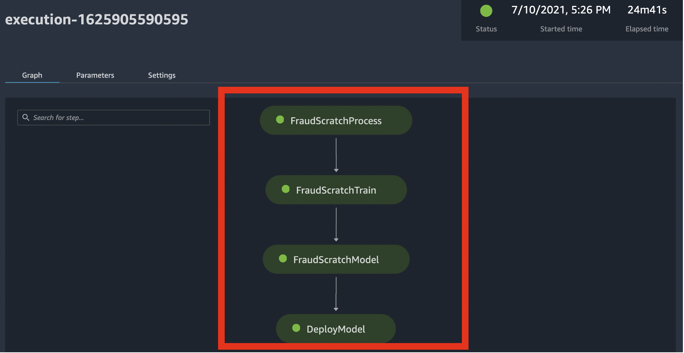

# SageMaker-Pipelines-Step-By-Step

## 1.워크샵 배경
- SageMaker Pipelines의 Modeling Building Pipepine (MBP) 을 Step-By-Step으로 진행을 하면서 배우는 것에 목적을 가집니다.
- MBP 의 각 단계(스텝) 별로 노트북이 구성 되어있고, 이 단계를 모두 마무리 한후에 마지막으로 모든 단계를 연결하여 파이프라인 생성을 합니다. 이후 MBP를 스케줄링하여 특정 시간에 실행하는 예시도 포함 합니다.

- 아래는 최종 파이프라인을 연결하여 완료된 MBP 입니다.

## 2.핸즈온 환경
- 세이지 메이커의 노트북 인스턴스에서 쥬피터 노트북을 통해 실행하세요.
- 또한 세이지 메이커의 스튜디오에서 생성된 파이프라인을 GUI 로 보면서 상태를 확인 하세요.

## 3. 노트북 구성

##### [Quick Approach] 
- Step-By-Step으로 접근하지 않고, 빠르게 보시기 위해서는 아래 노트북에서 2.1.prepare-env-dataset.ipynb, 8.5.all-pipeline.ipynb 두개만을 실행하시면 됩니다,

##### [Step-By-Step 접근]

- 1.1.skim-dataset.ipynb
    - 데이터 세트가 어떻게 구성이 되었는지 확인합니다.
- 2.1.prepare-env-dataset.ipynb
    - 환경 및 데이터 세트 준비 합니다.
- 3.1.preprocess-pipeline.ipynb
    - 첫번째의 전처리 과정의 스텝 생성 하며 아래 세가지의 단계별 구현을 합니다.
        - 로컬 노트북에서 전처리 스크립트 실행 (예: python preprocess.py)
        - 로컬 노트북에서 로컬 모드의 다커 컨테이너로 실행
        - MBP 의 파이프라인 단계 (step_proecess) 를 생성하여 실행
- 4.1.train-pipeline.ipynb
    - 훈련 과정의 스텝 생성
- 5.1.eval-pipeline.ipynb
    - 훈련후에 생성된 모델을 로딩하여 추론 후에 평가하는 스텝 생성
        - 3가지 방식 구현 (로컬 스크립트, 로컬 다커 모드, MBP 모드)
- 6.1.create-model-pipeline.ipynb
    - 세이제 메이커 모델 생성 단계
- 8.1.deploy-pipeline.ipynb
    - 실시간 엔드포인트 생성 단계
        - 2가지 방식 구현 (로컬 스크립트, MBP 모드)
- 8.5.all-pipeline.ipynb
    - 위에 생성한 모든 MBP 스텝을 연결하여 모든 파이프라인을 생성 함.
- 9.1.Inference-Analyze.ipynb
    - 최종적으로 생성한 실시간 엔드포인트에 추론 테스트
- 9.5.schedule-pipeline.ipynb
    - 매일 매 시간마다 MBP를 실행하는 예시
    
## 참고 자료

- Blog: Architect and build the full machine learning lifecycle with AWS: An end-to-end Amazon SageMaker demo
    - https://aws.amazon.com/blogs/machine-learning/architect-and-build-the-full-machine-learning-lifecycle-with-amazon-sagemaker/
    - Code: https://github.com/aws/amazon-sagemaker-examples/tree/master/end_to_end+
    
- Amazon SageMaker Model Building Pipelines
    - 세이지 메이커 모델 빌딩 파이프라인의 개발자 가이드
    - https://docs.aws.amazon.com/sagemaker/latest/dg/pipelines.html

- Amazon SageMaker Local Mode Examples    
    - 로컬 모드에서 사용하는 예시 (로컬 노트북에서 PyCharm 으로 훈련 및 서빙 예시)
    - https://github.com/aws-samples/amazon-sagemaker-local-mode

- Run Amazon SageMaker Notebook locally with Docker container
    - https://towardsdatascience.com/run-amazon-sagemaker-notebook-locally-with-docker-container-8dcc36d8524a
    
    
- XGBoost Parameters
    - XGBoost 파라미터 설명
    - https://xgboost.readthedocs.io/en/latest/parameter.html
